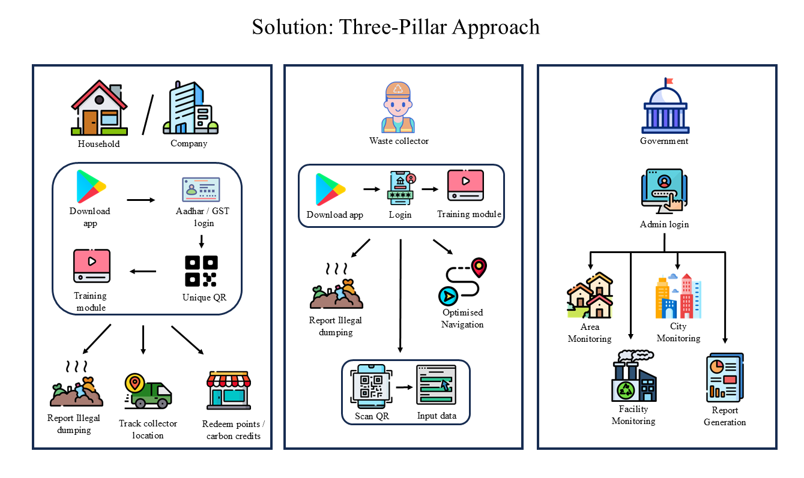

# **SwachhSathi** ♻️
[](LICENSE)
[](https://sih.gov.in/)
---
## **Description** 📝

### 🌍 Vision and Core Objective 
SwachhSathi is a prototype developed for the **Smart India Hackathon** with the mission to transform urban waste management in India. The project seeks to eliminate the 22% of unaccounted waste through a **technology-driven, accountable, and participatory system**. By creating a circular economy, SwachhSathi ensures waste is tracked from every generator to its final processing, maximizing resource recovery and minimizing landfill burden.

### 🚮 The Problem Addressed
- ⚠️ **Low Source Segregation:** Poor compliance due to lack of monitoring.  
- ♻️ **Inefficient Collection:** Mixed waste increases processing costs.  
- 📊 **Data Opacity:** ULBs lack granular data for decision-making.  
- 🙍 **Limited Citizen Engagement:** Awareness campaigns fail to sustain behavioral change.  

### 🛠️ Solution Architecture: A Three-Pillar Approach

1. **📱 User Application**
   - 🧑‍🏫 In-app multi-lingual training modules.  
   - 🏠 QR-based accountability for each household.  
   - 📍 Geo-tagged reporting of illegal dumping.  
   - 🎁 Incentives through redeemable reward points / Carbon credits.  
   - 🚛 Features like live collector tracking and facility locators.  

2. **🚮 Waste Collector Application**
   - 📲 QR code scanning for waste logging and compliance.  
   - 🤖 AI-driven route optimization.  
   - 🦺 Safety and training modules.  
   - 🚨 Real-time issue reporting.  

3. **🖥️ ULB Admin Dashboard**
   - 📡 Centralized real-time monitoring of segregation and collection efficiency.  
   - 🛑 Automated compliance enforcement.  
   - 👥 Empowering volunteers with decentralized oversight.  
   - 🏭 Infrastructure capacity and performance tracking.  

### ⚙️ Technological Stack
- **Frontend:** ⚛️ React Native (mobile apps), React.js (dashboard)  
- **Backend:** 🟩 Node.js with Express.js  
- **Database:** 🍃 MongoDB & 🐘 PostgreSQL  
- **Authentication:** 🆔 Aadhaar-based e-KYC (UIDAI APIs)  
- **Cloud:** ☁️ AWS/Azure with Kubernetes  
- **IoT Integration (future scope):** 📡 Bin monitoring   

### 📜 Policy Alignment and Innovation
- ✅ Supports **SBM-U 2.0** and **SWM Rules 2016**.  
- 💡 Unique features:
  1. 🏠 Household-level QR traceability.  
  2.  🔄 Closed-loop accountability.  
  3.  🌱 Decentralized governance via “Green Champions.”  

### 🛣️ Implementation Roadmap
1. 🚀 Pilot deployment in a smart city ward.  
2. 🌐 Scale-up across full ULB.  
3. 🇮🇳 National rollout with MoHUA partnership.  

### 🎯 Expected Outcomes
- 🌿 **Environmental:** Reduce unaccounted waste to <5%.  
- 💰 **Economic:** Lower costs, create green jobs.  
- 👨‍👩‍👧‍👦 **Social:** Empower waste workers, build community ownership.  

### 💹 Sustainability Model
- 💵 Revenue from ULB licensing, CSR partnerships, plastic credit monetization.  
- 📉 Cost savings through landfill reduction and recycling revenue.  

---

## **Install Dependencies**📦

To install the project dependencies, run:

```bash
npm install
```
---

## **Run the Development Server** 🚀

To start the development server, run:
```bash
npm run dev
```
---

## **Contributing** 🤝

We welcome contributions to make SwachhSathi better! To contribute:

### 🐞 Reporting Bugs

Open an issue with detailed reproduction steps so we can fix it quickly.

### ✨ Requesting Features

Suggest new features via issues with clear use cases.

### 🔀 Pull Requests

1. 🍴 Fork the repository.

2. 🌱 Create a feature branch:

``` bash
git checkout -b feature-name
```
3. 💾 Commit changes with clear messages.

4. 📤 Push your branch and submit a pull request.

### 📝 Commit Messages

**Follow the convention:**

* feat: ➡️ for new features.

* fix: 🐛 for bug fixes.

* docs: 📚 for documentation updates.

* test: ✅ for adding tests.

### 🔍 Code Style
- Use Prettier for code formatting
- Follow React/TypeScript best practices
- Write meaningful comments for complex logic

### 🧪 Testing Guidelines
- Write unit tests for new components
- Test edge cases for API endpoints
- Update snapshot tests if UI changes

### 📖 Documentation

Update README and inline docs if functionality changes.

---

## **🛡️ License**
This project is licensed under the [MIT License](LICENSE). You are free to use, modify, and share this project with proper attribution.
